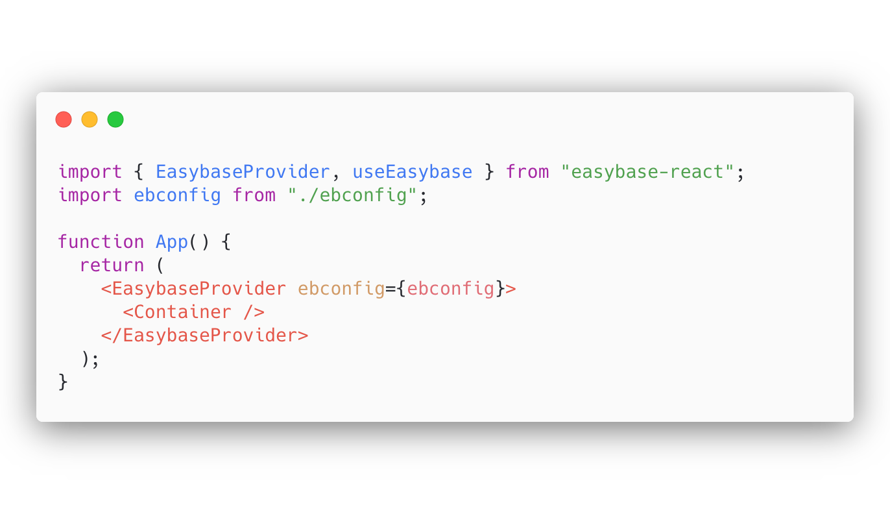
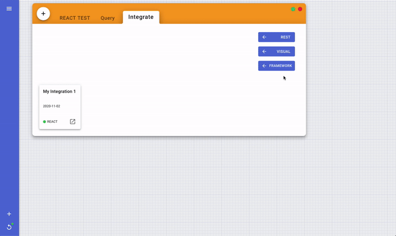
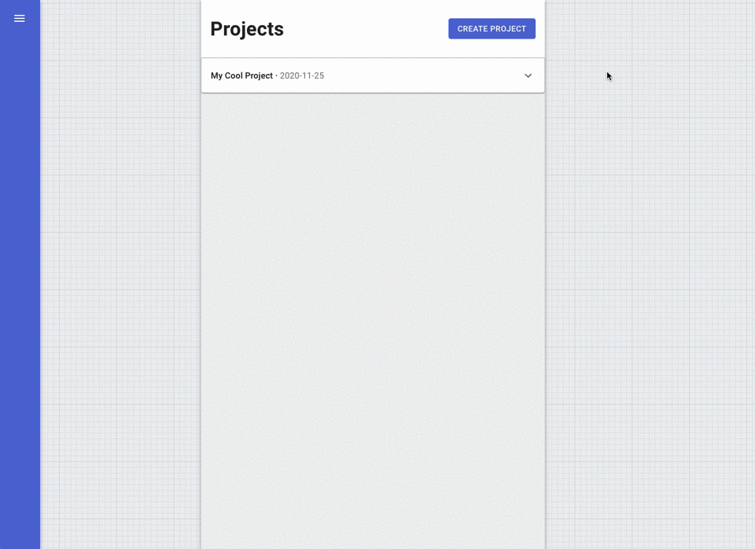

<!-- PROJECT LOGO -->
<p align="center">
  
</p>

<br />

<p align="center">
  <a href="https://easybase.io">
    
  </a>
</p>

<br />

<p align="center">
  
  
  
  
</p>

<br />

<!-- TABLE OF CONTENTS -->
## Table of Contents

* [About the Project](#about-the-project)
  * [Purpose](#purpose)
  * [Built With](#built-with)
* [Getting Started](#getting-started)
  * [Prerequisites](#prerequisites)
  * [Installation](#installation)
* [Usage](#usage)
* [Documentation](https://easybase.io/docs/easybase-react/)
* [Example](#example)
* [Contributing](#contributing)
* [License](#license)
* [Contact](#contact)


<!-- ABOUT THE PROJECT -->
## About The Project
React and React Native compatible library for use with EasyBase. This library works with a **free or premium** account. `easybase-react` can be used with a table specific REACT integration or with a Project. In the latter case, this package provides functions for managing user authentication. Documentation for this project can be found [here](#useEasybase). 


| REACT Integration          | Project                    |
|----------------------------|----------------------------|
| Live usage analytics       | Live usage analytics       |
| Custom table permissions   | Custom table permissions   |
| Stateful database array    | Stateful database array    |
| Access to visual queries   | Access to visual queries   |
| *~~User authentication~~*        | User authentication        |
| *~~Get/Set user attributes~~*    | Get/Set user attributes    |
| *~~Access multiple tables~~*     | Access multiple tables     |
| *~~Associate records to users~~* | Associate records to users |

[Click here](https://easybase.io/about/2020/09/20/The-Best-Way-To-Add-A-Database-To-Your-React-React-Native-Apps/) to learn more about Easybase.io and check out the examples below.

### Purpose

This project aims to be the most developer-friendly serverless framework for React. The **only** configuration needed to get this library up and running is an `ebconfig.js` token, as provided by Easybase. Your project will instantly have access to the features laid out in the above table.

### Built With

* [create-react-library](https://github.com/transitive-bullshit/create-react-library)
* [axios](https://github.com/axios/axios)
* [easybase.io](https://easybase.io)
* [object-observer](https://github.com/gullerya/object-observer)
* [microbundle](https://github.com/developit/microbundle)


<!-- GETTING STARTED -->
## Getting Started

### Prerequisites

* React 16.8.0
* npm

### Installation

```sh
npm install easybase-react
```

#### Create a React integration or Project

<p align="center">
  
  <br />
  <br />
  
</p>

#### Then, download your token and place it the root of your project

<pre>
├── src/
│   ├── App.js
│   ├── index.js
│   └── ebconfig.js
├── assets/
├── package.json
└── ...
</pre>

<!-- USAGE EXAMPLES -->
## Usage

Wrap your root component in *EasybaseProvider* with your credentials.
```jsx
import React, { useEffect } from "react";
import { EasybaseProvider, useEasybase } from 'easybase-react';
import ebconfig from "./ebconfig.json";

function App() {
  return (
    <EasybaseProvider ebconfig={ebconfig}>
      <Container />
    </EasybaseProvider>
  );
}
```

<br />

<details>
<summary>If you're using a project, implement a sign-in/sign-up workflow for users.</summary>
<p>

```jsx
function ProjectUser() {
  const [usernameValue, setUsernameValue] = useState("");
  const [passwordValue, setPasswordValue] = useState("");

  const {
    isUserSignedIn,
    signIn,
    signUp,
    getUserAttributes
  } = useEasybase();

  if (isUserSignedIn()) {
    return (
      <div>
        <h2>Your signed in!</h2>
        <button onClick={ _ => getUserAttributes().then(console.log) }>
          Click me only works if your authenticated!
        </button>
        <Container />
      </div>
    )
  } else {
    return (
      <div style={{ display: "flex", flexDirection: "column" }}>
        <h4>Username</h4>
        <input value={usernameValue} onChange={e => setUsernameValue(e.target.value)} />
        <h4>Password</h4>
        <input type="password" value={passwordValue} onChange={e => setPasswordValue(e.target.value)} />
        <button onClick={_ => signIn(usernameValue, passwordValue)}>
          Sign In
        </button>
        <button onClick={_ => signUp(usernameValue, passwordValue)}>
          Sign Up
        </button>
      </div>
    )
  }
}
```

</p>
</details>

<br />

<details>
<summary>Then, interface with your data in a stateful and synchronous manner.</summary>
<p>

```jsx
function Container() {
  const { Frame, useFrameEffect, configureFrame, sync } = useEasybase();

  useEffect(() => {
    configureFrame({ limit: 10, offset: 0 });
    sync();
  }, []);

  useFrameEffect(() => {
    console.log("Frame data changed!");
  });

  const onChange = (index, column, newValue) => {
      Frame(index)[column] = newValue;
      sync();
  }

  return (
    <div>
      {Frame().map(ele => <Card {...ele} onChange={onChange} index={index}  />)}
    </div>
  )

}
```

</p>
</details>

<br />
 
**Frame()** acts just like a plain array! When you want to push changes and synchronize with your data, just call **sync()**.

<!-- DOCUMENTATION -->
## Documentation

Documentation for this library [is available here](https://easybase.io/docs/easybase-react/).

<!-- EXAMPLES -->
## Example

[Stateful database array walkthrough](https://easybase.io/react/2020/09/20/The-Best-Way-To-Add-A-Database-To-Your-React-React-Native-Apps/)

[User authentication walkthrough](https://easybase.io/react/2020/09/20/The-Best-Way-To-Add-A-Database-To-Your-React-React-Native-Apps/)

<!-- CONTRIBUTING -->
## Contributing

Contributions are what make the open source community such an amazing place to be learn, inspire, and create. Any contributions you make are **greatly appreciated**.

1. Fork the Project
2. Create your Feature Branch (`git checkout -b feature/EasybaseReactFeature`)
3. Commit your Changes (`git commit -m 'feature'`)
4. Push to the Branch (`git push origin feature/EasybaseReactFeature`)
5. Open a Pull Request


<!-- LICENSE -->
## License

Distributed under the MIT License. See `LICENSE` for more information.


<!-- CONTACT -->
## Contact

[@easybase_io](https://twitter.com/easybase_io) - hello@easybase.io

Project Link: [https://github.com/easybase/easybase-react](https://github.com/easybase/easybase-react)
