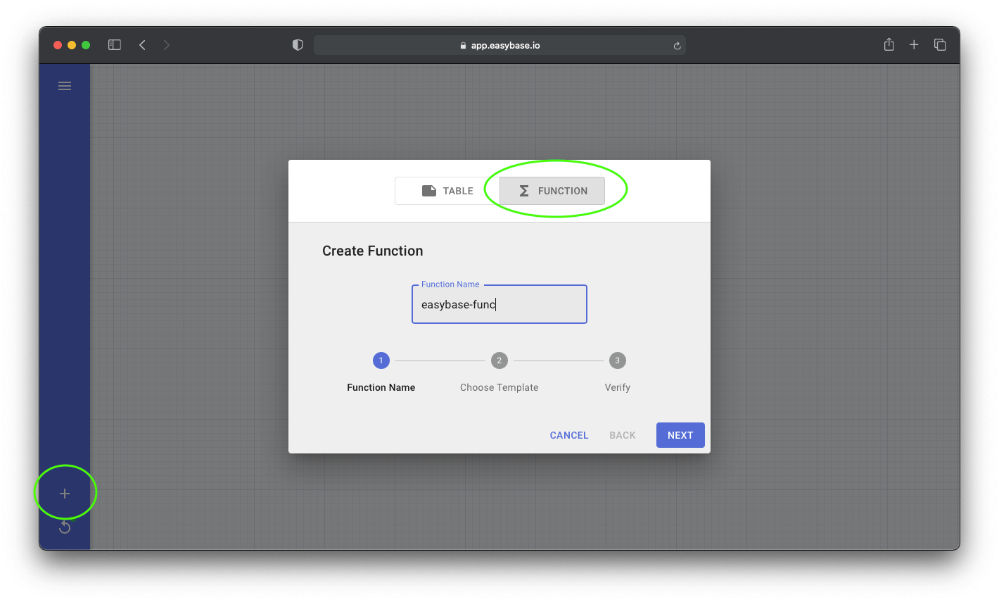
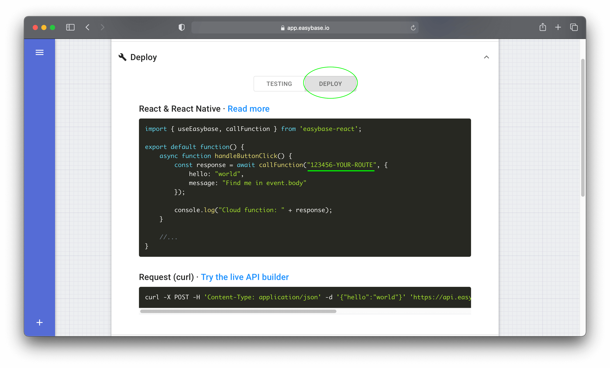

<!-- PROJECT LOGO -->
<p align="center">
  
</p>

<br />

<p align="center">
  <a href="https://easybase.io">
    
  </a>
</p>

<br />

<p align="center">
  
  
  
  
</p>

<br />

<!-- TABLE OF CONTENTS -->
## Table of Contents

* [About the Project](#about-the-project)
  * [Purpose](#purpose)
  * [Built With](#built-with)
* [Getting Started](#getting-started)
  * [Prerequisites](#prerequisites)
  * [Installation](#installation)
* [Usage](#usage)
* [Documentation](https://easybase.io/docs/easybase-react/)
* [Examples](#examples)
* [Troubleshoot](#troubleshoot)
* [License](#license)
* [Contact](#contact)


<!-- ABOUT THE PROJECT -->
## About The Project
React and React Native compatible library for use with Easybase. This serverless platform works with a **free** account. `easybase-react` can be used with a table's REACT integration or with a Project. In the latter case, this package provides functions for managing user authentication. Documentation for this project can be found [here](#useEasybase). 


| REACT Integration                | Project                    |
|----------------------------------|----------------------------|
| Live usage analytics             | Live usage analytics       |
| Custom table permissions         | Custom table permissions   |
| Database query builder           | Database query builder     |
| Access to visual queries         | Access to visual queries   |
| *~~User authentication~~*        | User authentication        |
| *~~Get/Set user attributes~~*    | Get/Set user attributes    |
| *~~Access multiple tables~~*     | Access multiple tables     |
| *~~Associate records to users~~* | Associate records to users |

**Cloud functions** can be invoked using this package with the automatically generated route as provided by Easybase. [Click here](https://easybase.io/react/) to learn more about Easybase.io and check out the examples below.

### Purpose

This project aims to be the most developer-friendly serverless framework for React. Functions and attributes of `easybase-react` are stateful and explicitly follow the React component lifecycle. 

The **only** configuration needed to get this library up and running is an `ebconfig.js` token, as provided by Easybase. Your React & React Native applications will instantly have secure access to the features laid out in the above table.

### Built With

* [create-react-library](https://github.com/transitive-bullshit/create-react-library)
* [cross-fetch](https://github.com/lquixada/cross-fetch)
* [easybase.io](https://easybase.io)
* [object-observer](https://github.com/gullerya/object-observer)
* [microbundle](https://github.com/developit/microbundle)


<!-- GETTING STARTED -->
## Getting Started

### Prerequisites

* React 16.8.0
* npm

### Installation

```sh
npm install easybase-react
```

### Database
#### Create a React integration or Project

<p align="center">
  
  <br />
  <br />
  
</p>

#### Then, download your token and place it at the root of your project

<pre>
├── src/
│   ├── App.js
│   ├── index.js
│   └── ebconfig.js
├── assets/
├── package.json
└── ...
</pre>

### Cloud Functions

#### Deploy a new cloud function

<p align="center">
  
</p>

#### Take note of the automatically generated route

<p align="center">
  
</p>

<!-- USAGE EXAMPLES -->
## Usage

### Database

Wrap your root component in *EasybaseProvider* with your credentials.
```jsx
import React, { useEffect } from "react";
import { EasybaseProvider, useEasybase } from 'easybase-react';
import ebconfig from "./ebconfig.json";

function App() {
  return (
    <EasybaseProvider ebconfig={ebconfig}>
      <Container />
    </EasybaseProvider>
  );
}
```

<br />

<details>
<summary>If you're using a project, implement a sign-in/sign-up workflow for users.</summary>
<p>

```jsx
function ProjectUser() {
  const [usernameValue, setUsernameValue] = useState("");
  const [passwordValue, setPasswordValue] = useState("");

  const {
    isUserSignedIn,
    signIn,
    signUp,
    getUserAttributes
  } = useEasybase();

  if (isUserSignedIn()) {
    return (
      <div>
        <h2>Your signed in!</h2>
        <button onClick={ _ => getUserAttributes().then(console.log) }>
          Click me only works if your authenticated!
        </button>
        <Container />
      </div>
    )
  } else {
    return (
      <div style={{ display: "flex", flexDirection: "column" }}>
        <h4>Username</h4>
        <input value={usernameValue} onChange={e => setUsernameValue(e.target.value)} />
        <h4>Password</h4>
        <input type="password" value={passwordValue} onChange={e => setPasswordValue(e.target.value)} />
        <button onClick={_ => signIn(usernameValue, passwordValue)}>
          Sign In
        </button>
        <button onClick={_ => signUp(usernameValue, passwordValue)}>
          Sign Up
        </button>
      </div>
    )
  }
}
```

</p>
</details>

<br />

<details>
<summary>Then, interface with your data in a stateful and synchronous manner.</summary>
<p>

[EasyQB](https://easybase.github.io/EasyQB/) is a powerful query builder to perform **Select**, **Update**, **Insert**, and **Delete** operations on your table. You can access this through the `.db` function. [Learn how to use the `.db` function here](https://easybase.github.io/EasyQB/). Here's an example of how to use a simple clause to read and insert data with your table.

```jsx
function Container() {
  const { db } = useEasybase();

  const [easybaseData, setEasybaseData] = useState([])
  const [currentPage, setCurrentPage] = useState(0)

  useEffect(() => {
    const mounted = async () => {
      const res = await db('MY TABLE').return().limit(10).offset(currentPage * 10).all()
      setCurrentData(res)
    }

    mounted();
  }, [currentPage]);

  const onChange = async (_key, column, newValue) => {
      await db('MY TABLE').set({ [column]: newValue }).where({ _key: _key }).one()
  }

  const onChangePage = (pageNum) => {
    setCurrentPage(pageNum)
  }

  return (
    <div>
      {easybaseData.map(ele => <Card
          {...ele}
          onChangeValue={onChangeValue}
          onChangePage={onChangePage}
        />
      )}
    </div>
  )

}
```

To see just how much functionality is packed into the `.db` function (aggregators, grouping, expressions), [check out the documentation here](https://easybase.github.io/EasyQB/).
</p>
</details>

<br />
 
Learn about using the `.db` function for [Select](https://easybase.github.io/EasyQB/docs/select_queries.html), [Update](https://easybase.github.io/EasyQB/docs/update_queries.html), [Delete](https://easybase.github.io/EasyQB/docs/delete_queries.html), or [Insert](https://easybase.github.io/EasyQB/docs/insert_queries.html) queries!

### Cloud Functions

The *EasybaseProvider* pattern is not necessary for invoking cloud functions, only *callFunction* is needed.
```jsx
import { callFunction } from 'easybase-react';

function App() {
    async function handleButtonClick() {
        const response = await callFunction("123456-YOUR-ROUTE", {
            hello: "world",
            message: "Find me in event.body"
        });

        console.log("Cloud function: " + response);
    }

    //...
}
```

<!-- DOCUMENTATION -->
## Documentation

Documentation for this library [is available here](https://easybase.io/docs/easybase-react/).

Information on **database querying** [can be found in the EasyQB docs](https://easybase.github.io/EasyQB/).

<!-- EXAMPLES -->
## Examples

[User authentication walkthrough](https://www.freecodecamp.org/news/build-react-native-app-user-authentication/)

[Deploying cloud functions](https://easybase.io/react/2021/03/09/The-Easiest-Way-To-Deploy-Cloud-Functions-for-your-React-Projects/)

<!-- TROUBLESHOOT -->
## Troubleshoot

#### React Native

For React Native users, this library will not work with [expo](https://expo.io/) due to native dependencies. Instead, use `react-native run-ios`.

Errors can arise because this library depends on [Async Storage](https://react-native-async-storage.github.io/async-storage/docs/install/) which requires *linking*. This package attempts to automatically handle this for you during postinstall (`scripts/postinstall.js`). If this script fails or you encounter an error along the lines of `Unable to resolve module '@react-native-community/async-storage'...`, here are two different methods to configure your React Native project.

  1. `npm start -- --reset-cache`
  2. Exit bundler, proceed as normal

  Or

  1. `npm install @react-native-community/async-storage@1.12.1`
  2. [Link package via these instructions](https://github.com/react-native-async-storage/async-storage/tree/9aad474ff7ca64d34ef94358a39205a609455aca#link)


#### React

No linking is required for React. If you encounter any errors during installation or runtime, simply reinstall the library.

  1. Delete `node_modules/` folder
  2. `npm install easybase-react`

<!-- LICENSE -->
## License

Distributed under the MIT License. See `LICENSE` for more information.

<!-- CONTACT -->
## Contact

[@easybase_io](https://twitter.com/easybase_io) - hello@easybase.io

Project Link: [https://github.com/easybase/easybase-react](https://github.com/easybase/easybase-react)

<a href="https://www.producthunt.com/posts/easybase-io?utm_source=badge-featured&utm_medium=badge&utm_souce=badge-easybase-io" target="_blank"></a>
